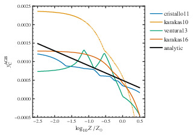
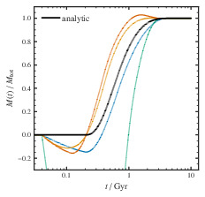
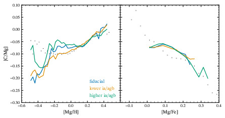
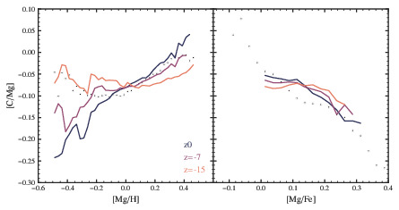
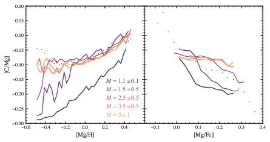
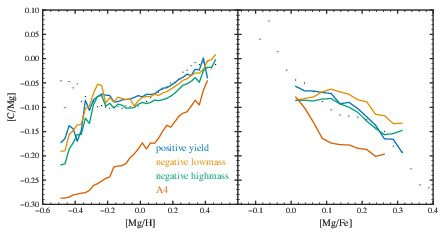
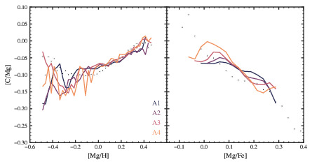

Analytic AGB yields
===================

The equation
------------

Defining a succinct, minimal-parameter representation of AGB C behavior is challenging. 
AGB yields generally have the following properties
- a peak yield at mass between 2 and 3 Msun
- asymmetric peak
- near zero yield at both 1Msun and 8Msun
- metallicity dependent total yield
- metallicity dependent peak location
- negative yields at lowest and highest masses at high metallicity

As a simple working model, we use cubic splines to represent the mass dependence multiplied by a linear metallicity-dependent term. 
Our parameters are 
- $m_0$
- $\delta m_+$
- $\delta m_-$
- $\zeta = dy/dz$
- $y_1$, the total yield at solar metallicity
- $y_0$, the (negative) low-mass yield
- $y_2$, the (negative) upper-intermediate-mass yield

$$
\tilde{y}_{\rm C}^{\rm CC} = 
$$

Comparison to existing models
----------

Effects of alternate parameters
-------------------------------

### AGB fraction

### Metallicity dependence

Figure: This is a figure

### Mass distribution

### Negative yields

### Alternate SFH

Summary
================
